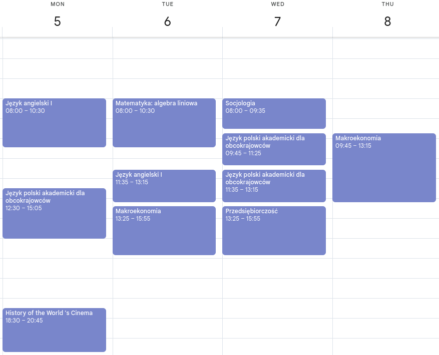
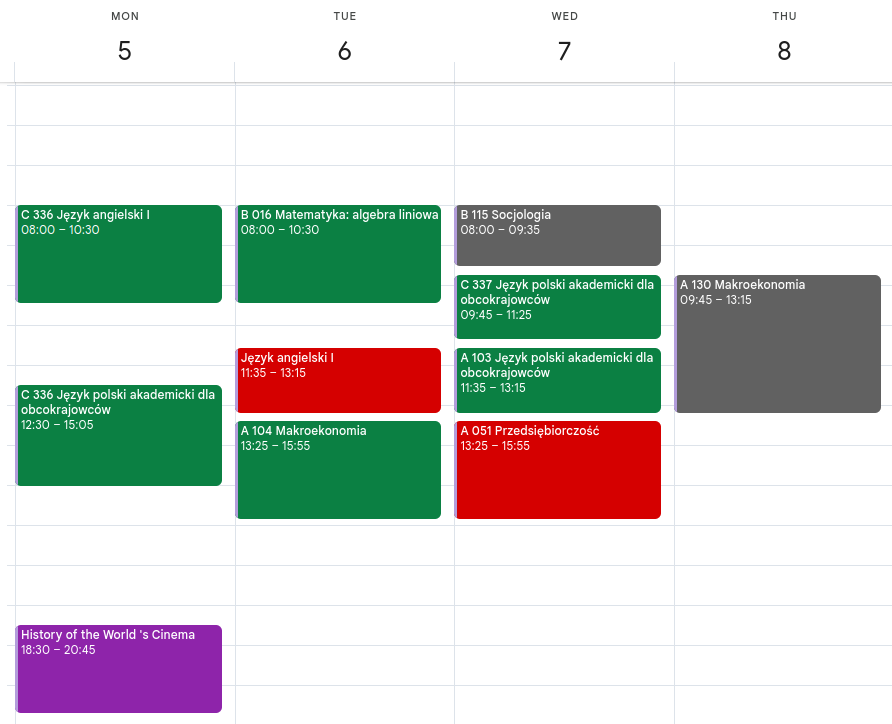

# **ICS Importer for Google Calendar** 📅✨

<p align="center">
  <a href="docs/pl.md"></a>
  <a>  </a>
  <a href="README.md"></a>
  <a>  </a>
  <a href="docs/ua.md"></a>
</p>

**Welcome to the ICS Importer!** **This Python script is designed to import events from an** **ICS** **file into your** **Google Calendar**. **It’s specifically tailored for importing schedules from** [**Uniwersytet Andrzeja Frycza Modrzewskiego**](https://uafm.edu.pl/). **You can get the ICS file from** **[this link](https://dziekanat.uafm.edu.pl/Plany/PlanyGrup)**. **If you don't already have a calendar, the script will create a new one for you. It also cleans up old events (older than 30 days) before importing new ones.**

<div align="center">
  <h3><strong>Calendar View</strong></h3>
</div>

|             **Before**              |             **After**             |
| :---------------------------------: | :-------------------------------: |
|  |  |

<div align="center">
  <h3><strong>Event Description View</strong></h3>
</div>

|                            **Before**                             |                            **After**                            |
| :---------------------------------------------------------------: | :-------------------------------------------------------------: |
|  |  |

**Color legend (event types):**

- 🟥 **Tomato** – Exam
- 🟪 **Grape** – Online or Cancelled
- ⬜ **Graphite** – Lecture
- 🟩 **Basil** – Class / Seminar
- 🟦 **Peacock** – Laboratory
- 🟨 **Banana** – Other / Unknown

**You can change colors by editing the `COLORS` dictionary and related conditions in the code.**

## **Installation** 🛠️

**Before running the script, ensure you have the following dependencies installed:**

```bash
pip install gcsa ics pytz
```

## **Setup Google API Credentials** 🔑

**In order to interact with your Google Calendar, you need to set up your API credentials.**

### **Steps to get your Google API credentials:**

1. **Create a new Google Cloud Platform (GCP) project**[Follow this guide to create a project](https://developers.google.com/workspace/guides/create-project).

   - **Important**: **Enable the** **Google Calendar API** **for your project.**

2. **Configure the OAuth consent screen**
   [Follow this guide for configuring the OAuth consent screen](https://developers.google.com/workspace/guides/configure-oauth-consent).
3. **Create an OAuth client ID credential**
   [Create OAuth credentials and download the `credentials.json`](https://developers.google.com/workspace/guides/create-credentials#oauth-client-id).
4. **Store the credentials**
   **Place the downloaded** `credentials.json` **file (client*secret*\*.json) into the** `~/.credentials/` **directory.**

> **Note**: **You may find** [**this quickstart guide**](https://developers.google.com/workspace/calendar/api/quickstart/python) **helpful for setting up Google Calendar API credentials.**

## **Usage** 🎉

### **Example 1: Import Events to a Specific Calendar** 🗓️

**If you already have a calendar:**

```python
from main import ics_import
from config import calendar_id

ics_import(calendar_id)
```

### **Example 2: Create a New Calendar and Import Events** 🌐

**If no calendar is provided, a new one will be created:**

```python
from main import ics_import

ics_import()
```

### **Example 3: Edit ICS File (Adjust Time Zone)** 🕰️

If you need to adjust the time zone of the events in your ICS file before importing, use the `ics_edit` function:

```python
from main import ics_edit

ics_edit()
```

This function allows you to clean up and adjust the start and end times of the events according to your desired time zone.

## **How It Works** ⚙️

- **Create or Use Google Calendar**: **If no** `calendar_id` **is provided, a new calendar named "Study" is created.**
- **Time Zone Handling**: **The script uses your calendar's time zone for event times.**
- **Event Cleanup**: **Events older than 30 days are deleted before new ones are added.**
- **Color Coding**: **Event colors are assigned based on the event type** (e.g., **Exam**, **Online**, **Group Work**).

## **Customization** 🎨

- **ICS File Path**: **Modify the** `ics_path` **parameter to use a different ICS file.**
- **Authentication**: **Skip browser authentication by setting** `open_browser=False` **if you've already authenticated.**

## **gcsa Documentation** 📚

**For full documentation on the** `gcsa` **library (which interacts with the Google Calendar API), visit:**
[**gcsa Documentation**](https://google-calendar-simple-api.readthedocs.io/en/latest/index.html)

## **License** 📜

**Licensed under GNU General Public License v3** - see the [**LICENSE**](LICENSE) file for details.
