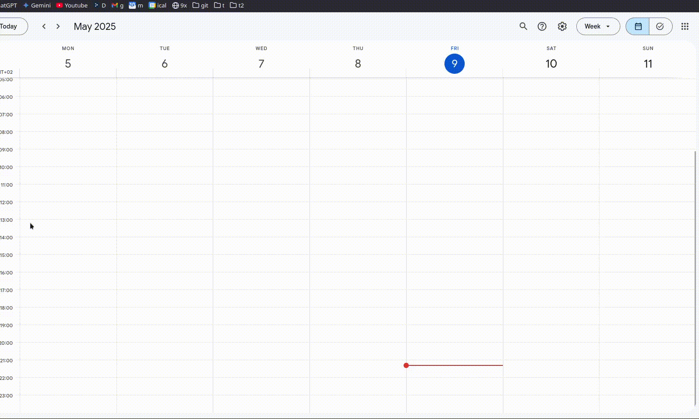

# **ICS Importer for Google Calendar** 📅✨

<p align="center">
  <a href="https://github.com/Anghkooey/uafm_ical/blob/main/LICENSE">
    
  </a>
  <a href="https://www.python.org/">
    
  </a>
  <a href="https://github.com/Anghkooey/uafm_ical/commits/main">
    
  </a>
  <a href="https://github.com/Anghkooey/uafm_ical/releases">
    
  </a>
</p>

<p align="center">
  <a href="docs/pl.md"></a>
  <a>  </a>
  <a href="README.md"></a>
  <a>  </a>
  <a href="docs/ua.md"></a>
</p>

**Welcome to the ICS Importer!** **This Python script is designed to import events from an** **ICS** **file into your** **Google Calendar**. **It’s specifically tailored for importing schedules from** [**Uniwersytet Andrzeja Frycza Modrzewskiego**](https://uafm.edu.pl/). **You can get the ICS file from** **[this link](https://dziekanat.uafm.edu.pl/Plany/PlanyGrup)**.

**✔️ Auto-creates a calendar if you don’t have one  
✔️ Deletes old entries (older than 30 days)  
✔️ Cleans up and formats your schedule like a pro**

## ✨ Key Features

- **Effortless Import:** Automatically add your schedule to Google Calendar.
- **Universal Compatibility:** Works with ICS files from various university systems (e.g., APR System, Mobilny Student).
- **New Calendar Option:** Creates a new "Study" calendar if you don't specify one.
- **Clean Calendar:** Removes events older than 30 days before importing.
- **Color-Coded Events:** Visually distinguish event types (Exams ❤️, Lectures 🖤, etc.).
- **Time Zone Handling:** Uses your Google Calendar's time zone for accurate event times.
- **Compiled Versions:** The application is also available as compiled executables for Windows and Linux, simplifying usage without Python installation. See the [Releases](https://github.com/Anghkooey/uafm_ical/releases) page.

## 🚀 Quick Preview

See the magic happen! ✨ This animation shows how the script imports your ICS schedule into Google Calendar.


<div align="center">
<h3>🗓️ Calendar View</h3>
</div>

|                      **Before**                      |                     **After**                      |
| :--------------------------------------------------: | :------------------------------------------------: |
|  |  |

<div align="center">
  <h3><strong>📝 Event Description View</strong></h3>
</div>

|                                     **Before**                                     |                                    **After**                                     |
| :--------------------------------------------------------------------------------: | :------------------------------------------------------------------------------: |
|  |  |

**Color legend (event types):**

- ❤️ **Tomato** – Exam
- 💜 **Grape** – Online or Cancelled
- 🖤 **Graphite** – Lecture
- 💚 **Basil** – Class / Seminar
- 💙 **Peacock** – Laboratory
- 💛 **Banana** – Other / Unknown

**You can change colors by editing the `COLORS` dictionary and related conditions in the code.**

### 💻 Quick Install & Run

Want it fast and easy? Use the compiled executables from [Releases](https://github.com/Anghkooey/uafm_ical/releases)!

- **Windows:** Grab `ics_edit_windows.exe` and go!


- **Linux:** Grab `ics_edit_linux` and go!

**Heads up!** For those sweet color-coded events like in the preview, you'll need the Python script and `ics_import` (see Examples above). The executables handle the core import, but Python unlocks the color magic ✨.

### 🗓️ ICS File Import Guide

This is a general guide on how to import an ICS file into Google Calendar.



## **Installation** 🛠️

1. **Prerequisites:** Make sure you have Python 3.x installed.
2. **Install Dependencies:**

```bash
pip install gcsa ics pytz
```

## 🔑 Setup Google API Credentials

Follow these steps to authorize the script to access your Google Calendar:

1. **Create a Google Cloud Platform (GCP) project:** [Guide](https://developers.google.com/workspace/guides/create-project)
   - **Important:** Enable the **Google Calendar API** for your project.
2. **Configure the OAuth consent screen:** [Guide](https://developers.google.com/workspace/guides/configure-oauth-consent)
3. **Create an OAuth client ID credential:** [Guide](https://developers.google.com/workspace/guides/create-credentials#oauth-client-id) and download `credentials.json`.
4. **Store the credentials:** Place the downloaded `credentials.json` file in the `~/.credentials/` directory.

> **Note:** This [quickstart guide](https://developers.google.com/workspace/calendar/api/quickstart/python) might be helpful.

## 🎉 Usage

### 🗓️ Example 1: Import to a Specific Calendar

```python
from main import ics_import

calendar_id = "YOUR_CALENDAR_ID"  # Replace with your actual Calendar ID
ics_import(calendar_id)
```

(Assuming you have `calendar_id` defined in `config.py`)

### 🌐 Example 2: Create a New Calendar and Import

```python
from main import ics_import

ics_import()
```

### 🕰️ Example 3: Edit ICS File (Adjust Time Zone)

```python
from main import ics_edit

ics_edit()
```

This function helps clean up and adjust event times.

## ⚙️ How It Works

- **Calendar Handling:** Creates a new "Study" calendar or uses an existing one.
- **Time Zone Magic:** Ensures events are in your calendar's time zone.
- **Cleanup Crew:** Removes old events to keep your calendar tidy.
- **Color Coordination:** Assigns colors based on event type.

## 🎨 Customization

- **ICS File Path:** Modify `ics_path` to use a different ICS file.
- **Authentication:** Set `open_browser=False` if you've already authenticated.

## 🤝 Contributing

**Feel free to contribute! Fork the repository, create a branch, and submit a pull request. Let's make this script even better together! 💪**

## 📜 License

**Licensed under the [GNU General Public License v3](https://www.google.com/search?q=LICENSE).**

## 📚 Documentation

**For detailed information about the `gcsa` library, visit: [gcsa Documentation](https://google-calendar-simple-api.readthedocs.io/en/latest/index.html)**

### <a target="_blank" href="https://icons8.com/icon/Xm1BwlEApHW6/google-calendar">Google Calendar</a> icon by <a target="_blank" href="https://icons8.com">Icons8</a>
