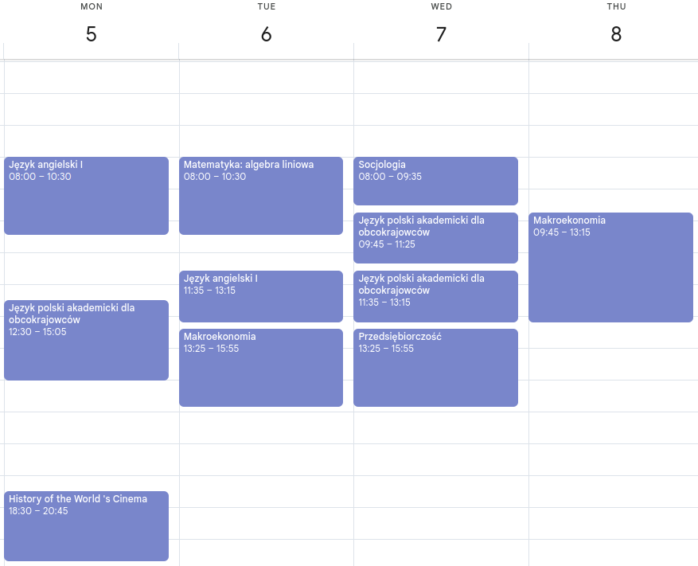
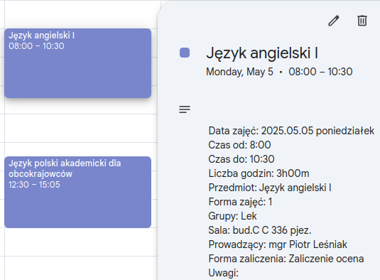
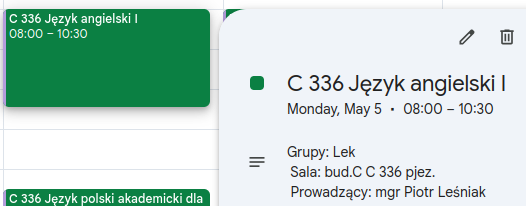

# **Importer ICS do Google Calendar** 📅✨

<p align="center">
  <a href="pl.md"></a>
  <a>  </a>
  <a href="/README.md"></a>
  <a>  </a>
  <a href="ua.md"></a>
</p>

**Witamy w ICS Importer!** **Ten skrypt w Pythonie jest zaprojektowany do importowania wydarzeń z pliku** **ICS** **do Twojego** **Google Calendar**. **Jest szczególnie dostosowany do importowania harmonogramów z** [**Uniwersytetu Andrzeja Frycza Modrzewskiego**](https://uafm.edu.pl/). **Plik ICS możesz pobrać z** **[tego linku](https://dziekanat.uafm.edu.pl/Plany/PlanyGrup)**. **Jeśli nie masz jeszcze kalendarza, skrypt utworzy nowy. Ponadto, przed importem nowych wydarzeń, usunie stare (starsze niż 30 dni).**

<div align="center">
  <h3><strong>Widok pełnoekranowy</strong></h3>
</div>

|         **Przed**         |        **Po**         |
| :-----------------------: | :-------------------: |
|  |  |

<div align="center">
  <h3><strong>Widok na komputerze</strong></h3>
</div>

|                      **Przed**                       |                      **Po**                      |
| :--------------------------------------------------: | :----------------------------------------------: |
|  |  |

**Legenda kolorów (rodzaje wydarzeń):**

- 🟥 **Tomato** – Egzamin
- 🟪 **Grape** – Zajęcia online lub odwołane
- ⬜ **Graphite** – Wykład
- 🟩 **Basil** – Ćwiczenia / Seminarium
- 🟦 **Peacock** – Laboratorium
- 🟨 **Banana** – Inne / Nieznane

**Możesz zmienić kolory, edytując słownik `COLORS` i powiązane warunki w kodzie.**

## **Instalacja** 🛠️

**Przed uruchomieniem skryptu upewnij się, że masz zainstalowane następujące zależności:**

```bash
pip install gcsa ics pytz
```

## **Konfiguracja poświadczeń Google API** 🔑

**Aby uzyskać dostęp do swojego Google Calendar, musisz skonfigurować poświadczenia API.**

### **Kroki, aby uzyskać poświadczenia Google API:**

1. **Utwórz nowy projekt na Google Cloud Platform (GCP)** [Postępuj zgodnie z tym przewodnikiem, aby utworzyć projekt](https://developers.google.com/workspace/guides/create-project).

   - **Ważne**: **Włącz API Google Calendar** **dla swojego projektu.**

2. **Skonfiguruj ekran zgody OAuth**
   [Postępuj zgodnie z tym przewodnikiem, aby skonfigurować ekran zgody OAuth](https://developers.google.com/workspace/guides/configure-oauth-consent).
3. **Utwórz poświadczenia OAuth Client ID**
   [Utwórz poświadczenia OAuth i pobierz plik `credentials.json`](https://developers.google.com/workspace/guides/create-credentials#oauth-client-id).
4. **Przechowaj poświadczenia**
   **Umieść pobrany plik** `credentials.json` **(client*secret*\*.json) w katalogu** `~/.credentials/`.

> **Uwaga**: **Możesz znaleźć** [**ten przewodnik szybko uruchamiający**](https://developers.google.com/workspace/calendar/api/quickstart/python) **pomocnym przy konfiguracji poświadczeń API Google Calendar.**

## **Użycie** 🎉

### **Przykład 1: Importuj wydarzenia do określonego kalendarza** 🗓️

**Jeśli już masz kalendarz:**

```python
from main import ics_import
from config import calendar_id

ics_import(calendar_id)
```

### **Przykład 2: Utwórz nowy kalendarz i zaimportuj wydarzenia** 🌐

**Jeśli kalendarz nie jest podany, zostanie utworzony nowy:**

```python
from main import ics_import

ics_import()
```

### **Przykład 3: Edytuj plik ICS (Dostosowanie strefy czasowej)** 🕰️

Jeśli potrzebujesz dostosować strefę czasową wydarzeń w swoim pliku ICS przed importem, użyj funkcji `ics_edit`:

```python
from main import ics_edit

ics_edit()
```

Ta funkcja umożliwia oczyszczenie i dostosowanie godzin rozpoczęcia i zakończenia wydarzeń zgodnie z wybraną strefą czasową.

## **Jak to działa** ⚙️

- **Utworzenie lub użycie kalendarza Google**: **Jeśli nie podano** `calendar_id` **utworzony zostaje nowy kalendarz o nazwie "Study".**
- **Obsługa strefy czasowej**: **Skrypt używa strefy czasowej Twojego kalendarza do ustalania godzin wydarzeń.**
- **Czyszczenie wydarzeń**: **Wydarzenia starsze niż 30 dni są usuwane przed dodaniem nowych.**
- **Kodowanie kolorów**: **Kolory wydarzeń są przypisywane w zależności od typu wydarzenia** (np. **Egzamin**, **Online**, **Ćwiczenia**).

## **Dostosowanie** 🎨

- **Ścieżka pliku ICS**: **Zmień parametr** `ics_path`, **aby używać innego pliku ICS.**
- **Autoryzacja**: **Pomiń autoryzację przez przeglądarkę, ustawiając** `open_browser=False` **jeśli już uwierzytelniono konto.**

## **Dokumentacja gcsa** 📚

**Pełna dokumentacja biblioteki** `gcsa` **(która współpracuje z Google Calendar API) jest dostępna pod adresem:**
[**Dokumentacja gcsa**](https://google-calendar-simple-api.readthedocs.io/en/latest/index.html)

## **Licencja** 📜

**Licencjonowane na warunkach GNU General Public License v3** - zobacz plik [**LICENSE**](/LICENSE) po szczegóły.
