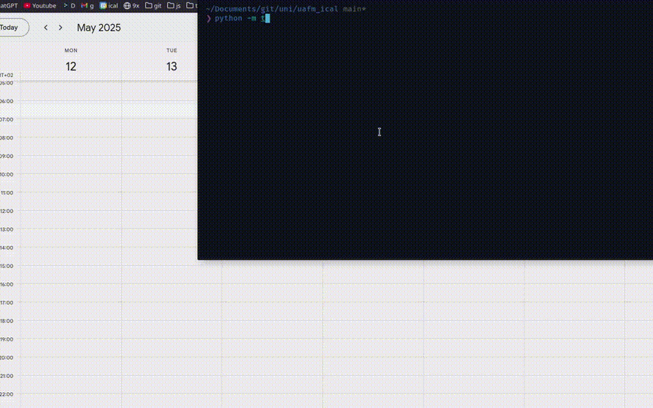

# **Proakademia2GCal**: Usprawnij swój kalendarz [**Proakademia**](https://www.dlauczelni.apr.pl/) 📅✨

<p align="center">
  <a href="https://github.com/Anghkooey/Proakademia2GCal/blob/main/LICENSE">
    
  </a>
  <a href="https://www.python.org/">
    
  </a>
  <a href="https://github.com/Anghkooey/Proakademia2GCal/commits/main">
    
  </a>
  <a href="https://github.com/Anghkooey/Proakademia2GCal/releases">
    
  </a>
</p>

<p align="center">
  <a href="pl.md"></a>
  <a>  </a>
  <a href="../README.md"></a>
  <a>  </a>
  <a href="ua.md"></a>
</p>

**Masz dość problemów z dodawaniem planu zajęć z [Uniwersytetu Andrzeja Frycza Modrzewskiego (UAFM)]((https://uafm.edu.pl/)) do Kalendarza Google?** 😩 Jako student _UAFM_, stworzyłem **Proakademia2GCal**, aby uprościć _edycję_ i _importowanie_ Twojego harmonogramu [**Proakademia**](https://www.dlauczelni.apr.pl/) do [**Kalendarza Google 🗓️**](https://calendar.google.com/), z żywymi kolorami i lepszą organizacją.

To narzędzie usprawnia pracę z Twoimi danymi harmonogramu, zwykle eksportowanymi jako plik **ICS** z modułu "Dziekanat" systemu [**Proakademia**](https://www.dlauczelni.apr.pl/) (używanego przez [**UAFM**](https://uafm.edu.pl/) i inne uczelnie oparte na [**APR**](https://www.apr.pl/) 🚀). Studenci _UAFM_ mogą łatwo pobrać swój plik ICS z **[Dziekanatu](https://dziekanat.uafm.edu.pl/Plany/PlanyGrup)** 🔗.

**Proakademia2GCal umożliwia:**

- ✔️ **Przygotowanie i ulepszenie pliku ICS** do dokładnego importu: dostosowanie stref czasowych i oczyszczenie danych.

- ✔️ **Importowanie harmonogramu do dedykowanego kalendarza "Studia" w Kalendarzu Google** 🧙‍♂️ (z opcją automatycznego tworzenia).

- ✔️ **Utrzymanie czystego kalendarza** 🧼 dzięki automatycznemu usuwaniu wydarzeń starszych niż 30 dni.

- ✔️ **Intuicyjne wizualizowanie harmonogramu** 🎨 z przejrzystym formatowaniem i _oznaczonymi kolorami typami zajęć_ (np. wykłady 🖤, laboratoria 💙, egzaminy ❤️).

**Wybierz metodę importu:**

- **Programiści:** Użyj bezpośrednio **skryptu Python** 🐍, aby uzyskać pełną kontrolę.
- **Wszyscy użytkownicy:** Pobierz **gotowe do użycia programy** 🚀 dla [Windows](https://github.com/Anghkooey/Proakademia2GCal/releases) 💻 i [Linux](https://github.com/Anghkooey/Proakademia2GCal/releases) 🐧.

## 🚀 Szybki podgląd

**Zobacz skrypt w akcji! ✨ Animacja pokazuje import planu zajęć do Google Kalendarza.**



<div align="center">
<h3>🗓️ Widok kalendarza</h3>
</div>

|                    **Przed**                    |                    **Po**                     |
| :---------------------------------------------: | :-------------------------------------------: |
|  |  |

<div align="center">
  <h3><strong>📝 Widok opisu wydarzenia</strong></h3>
</div>

|                                   **Przed**                                   |                                   **Po**                                    |
| :---------------------------------------------------------------------------: | :-------------------------------------------------------------------------: |
|  |  |

**Legenda kolorów (typy wydarzeń):**

- ❤️ **Tomato** – Egzamin
- 💜 **Grape** – Online lub Odwołane
- 🖤 **Graphite** – Wykład
- 💚 **Basil** – Ćwiczenia / Seminaria
- 💙 **Peacock** – Laboratoria
- 💛 **Banana** – Inne / Nieznane

> **Możesz edytować kolory w słowniku `COLORS` w kodzie źródłowym.**

### 💻 Szybka instalacja i uruchomienie

Chcesz szybko i łatwo? Użyj skompilowanych plików wykonywalnych z [Wydania](https://github.com/Anghkooey/Proakademia2GCal/releases)!

- **Windows:** Pobierz `ics_edit_windows.exe` i gotowe!


- **Linux:** Pobierz `ics_edit_linux` i gotowe!

**Uwaga!** Aby uzyskać te fajne, oznaczone kolorami wydarzenia, jak na podglądzie, potrzebujesz skryptu Pythona i `ics_import` (patrz Przykłady powyżej). Pliki wykonywalne obsługują podstawowy import, ale Python odblokowuje kolorową magię ✨.

### 🗓️ Przewodnik importu pliku ICS

To jest ogólny przewodnik po tym, jak importować plik ICS do Kalendarza Google.


## 🛠️ Instalacja

1. **Wymagania:** Python 3.x
2. **Instalacja zależności:**

```bash
pip install gcsa ics pytz
```

## 🔑 Konfiguracja Google API

Aby skrypt mógł używać Kalendarza Google, wykonaj następujące kroki:

1. **Utwórz projekt GCP:** [Instrukcja](https://developers.google.com/workspace/guides/create-project)
   - Włącz **Google Calendar API**
2. **Skonfiguruj ekran zgody OAuth:** [Instrukcja](https://developers.google.com/workspace/guides/configure-oauth-consent)
3. **Utwórz dane logowania OAuth:** [Instrukcja](https://developers.google.com/workspace/guides/create-credentials#oauth-client-id)
4. **Umieść plik `credentials.json` w katalogu `~/.credentials/`**

> Pomocna może być [szybka konfiguracja](https://developers.google.com/workspace/calendar/api/quickstart/python)

## 🎉 Użycie

### 🗓️ Przykład 1: Import do konkretnego kalendarza

```python
from src.main import ics_import

calendar_id = "YOUR_CALENDAR_ID"  # Zastąp rzeczywistym identyfikatorem kalendarza
ics_import(calendar_id)
```

### 🌐 Przykład 2: Utwórz nowy kalendarz i zaimportuj

```python
from src.main import ics_import

ics_import()
```

### 🕰️ Przykład 3: Edytuj plik ICS (zmiana strefy czasowej)

```python
from main import ics_edit

ics_edit()
```

## ⚙️ Jak to działa?

- **Obsługa kalendarza:** Tworzy nowy lub używa istniejącego.
- **Strefy czasowe:** Dopasowuje wydarzenia do Twojej strefy.
- **Sprzątanie:** Usuwa stare wydarzenia.
- **Kolory:** Przypisuje kolory wg typu wydarzenia.

## 🎨 Dostosowanie

- **Ścieżka do ICS:** Zmień `ics_path` w kodzie.
- **Logowanie:** Ustaw `open_browser=False`, jeśli już się autoryzowałeś.

## 🤝 Współpraca

**Masz pomysł lub poprawkę? Forkuj repozytorium, utwórz branch i wyślij pull requesta. Razem zrobimy to lepiej! 💪**

## 📜 Licencja

**Na licencji [GNU General Public License v3](https://www.google.com/search?q=LICENSE)**

## 📚 Dokumentacja

**Zajrzyj do dokumentacji biblioteki `gcsa`: [gcsa docs](https://google-calendar-simple-api.readthedocs.io/en/latest/index.html)**

### <a target="_blank" href="https://icons8.com/icon/Xm1BwlEApHW6/google-calendar">Google Calendar</a> icon by <a target="_blank" href="https://icons8.com">Icons8</a>
