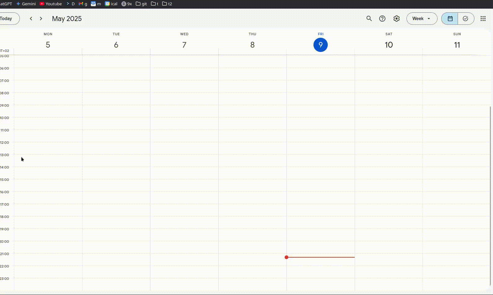

# **Proakademia2GCal**: Usprawnij swój kalendarz [**Proakademia**](https://www.dlauczelni.apr.pl/) 📅✨

<p align="center">
  <a href="https://github.com/Anghkooey/Proakademia2GCal/blob/main/LICENSE">
    
  </a>
  <a href="https://www.python.org/">
    
  </a>
  <a href="https://github.com/Anghkooey/Proakademia2GCal/commits/main">
    
  </a>
  <a href="https://github.com/Anghkooey/Proakademia2GCal/releases">
    
  </a>
</p>

<p align="center">
<br>
  <a href="pl.md"></a>
  <a>  </a>
  <a href="../README.md"></a>
  <a>  </a>
  <a href="ua.md"></a>
</p>

---

**🚀 Masz dość wolnych aplikacji i nieczytelnych planów zajęć? Poznaj Proakademia2GCal!**

Stworzony przez **[studenta pierwszego roku UAFM](https://uafm.edu.pl/)** 🎓, ten projekt pozwala łatwo i szybko zaimportować Twój plan z **[Proakademia](https://www.dlauczelni.apr.pl/)** do **[Google Kalendarza 🗓️](https://calendar.google.com/)** — z kolorami i pełną organizacją!

Dlaczego warto korzystać z **Google Kalendarza**?

- ⚡ **Błyskawiczny dostęp z każdego urządzenia** — otwórz go w przeglądarce lub w oficjalnej aplikacji na **iOS** i **Android**
- 🌍 **Pełna kompatybilność** — nie potrzebujesz żadnych dodatkowych programów ani instalacji, by mieć plan zawsze pod ręką
- 🎨 **Kolorowe oznaczenia wydarzeń:** wykłady 🖤, laboratoria 💙, egzaminy ❤️ — wszystko czytelne i przejrzyste

**Proakademia2GCal pozwala:**

- 🧹 **Wyczyścić i zoptymalizować plik ICS**, by import przebiegał bezproblemowo
- 🗓️ **Automatycznie utworzyć dedykowany kalendarz „Studia”** na Twoje zajęcia
- 🧼 **Utrzymać porządek** usuwając stare wydarzenia

**Jak zacząć?**

- 🐍 Skorzystaj ze skryptu w Pythonie dla pełnej kontroli
- 🚀 Lub pobierz gotowe aplikacje dla **[Windows](https://github.com/Anghkooey/Proakademia2GCal/releases)** 💻 i **[Linux](https://github.com/Anghkooey/Proakademia2GCal/releases)** 🐧

**Uprość swoje studia — planuj sprytniej!**

## 🚀 Szybki podgląd

**Zobacz skrypt w akcji! ✨ Animacja pokazuje import planu zajęć do Google Kalendarza.**


<div align="center">
<h3>🗓️ Widok kalendarza</h3>
</div>

|                    **Przed**                    |                    **Po**                     |
| :---------------------------------------------: | :-------------------------------------------: |
|  |  |

<div align="center">
  <h3><strong>📝 Widok opisu wydarzenia</strong></h3>
</div>

|                                   **Przed**                                   |                                   **Po**                                    |
| :---------------------------------------------------------------------------: | :-------------------------------------------------------------------------: |
|  |  |

**Legenda kolorów (typy wydarzeń):**

- ❤️ **Tomato** – Egzamin
- 💜 **Grape** – Online lub Odwołane
- 🖤 **Graphite** – Wykład
- 💚 **Basil** – Ćwiczenia / Seminaria
- 💙 **Peacock** – Laboratoria
- 💛 **Banana** – Inne / Nieznane

> **Możesz edytować kolory w słowniku `COLORS` w kodzie źródłowym.**

### 💻 Szybka instalacja i uruchomienie

Chcesz szybko i łatwo? Użyj skompilowanych plików wykonywalnych z [**Wydania**](https://github.com/Anghkooey/Proakademia2GCal/releases)!

- **Windows:** Pobierz `ics_edit_windows.exe` i gotowe!


- **Linux:** Pobierz `ics_edit_linux` i gotowe!

**Uwaga!** Aby uzyskać te fajne, oznaczone kolorami wydarzenia, jak na podglądzie, potrzebujesz skryptu Pythona i `ics_import` (patrz Przykłady powyżej). Pliki wykonywalne obsługują podstawowy import, ale Python odblokowuje kolorową magię ✨.

### 🗓️ Przewodnik importu pliku ICS

To jest ogólny przewodnik po tym, jak importować plik ICS do Kalendarza Google.



## 🛠️ Instalacja i Pierwsze Uruchomienie

Zaczynamy błyskawicznie — wykonaj te kroki, aby błyskotliwie zsynchronizować swój plan zajęć z Google Calendar! ⚡

### 1. 💾 Sklonuj Repozytorium

Najpierw pobierz projekt z GitHuba:

```bash
git clone https://github.com/Anghkooey/Proakademia2GCal
```

### 2. 📦 Zainstaluj Wymagane Biblioteki

Zanim uruchomisz skrypt, upewnij się, że masz zainstalowane wszystkie zależności:

```bash
pip install gcsa ics pytz oauthlib httplib2
```

### 3. 🚪 Wejdź do Folderu Źródłowego

Cała Pythonowa magia dzieje się w folderze `src`. Przejdź tam:

```bash
cd Proakademia2GCal/src
```

Twoje środowisko jest już gotowe, by jak profesjonalista zsynchronizować kalendarz akademicki! ✅

---

## 🔑 Konfiguracja Dostępu do Google Calendar (API)

Ten etap umożliwia bezpieczne połączenie skryptu z Twoim Google Kalendarzem przez OAuth2.0 🔐

### Wykonaj Kolejne Kroki:

1. 🎛️ **Utwórz Projekt w Google Cloud Platform (GCP):**
   👉 [Przewodnik krok po kroku](https://developers.google.com/workspace/guides/create-project)
   ☑️ Koniecznie włącz **Google Calendar API** w ustawieniach projektu.

2. 🧾 **Skonfiguruj ekran zgody OAuth:**
   📘 [Instrukcja konfiguracji](https://developers.google.com/workspace/guides/configure-oauth-consent)
   Dzięki temu Google będzie wiedziało, kto prosi o dostęp (czyli Ty).

3. 🔑 **Utwórz dane logowania OAuth 2.0 (Client ID):**
   🛠️ Skorzystaj z tego [oficjalnego poradnika](https://developers.google.com/workspace/guides/create-credentials#oauth-client-id)
   Następnie pobierz plik `credentials.json`.

4. 🗂️ **Umieść dane logowania w odpowiednim miejscu:**
   Przenieś lub skopiuj `credentials.json` do katalogu:

   ```bash
   ~/.credentials/credentials.json
   ```

   > 💡 Jeśli katalog `.credentials/` nie istnieje — po prostu go utwórz!

📚 Potrzebujesz wizualnego przewodnika?
Google przygotowało świetny [Python Quickstart](https://developers.google.com/workspace/calendar/api/quickstart/python), który przeprowadzi Cię przez cały proces.

## 🎉 Użycie

### 🗓️ Przykład 1: Import do konkretnego kalendarza

```python
from main import ics_import

calendar_id = "YOUR_CALENDAR_ID"  # Zastąp rzeczywistym identyfikatorem kalendarza
ics_import(calendar_id)
```

### 🌐 Przykład 2: Utwórz nowy kalendarz i zaimportuj

```python
from main import ics_import

ics_import()
```

### 🕰️ Przykład 3: Edytuj plik ICS (zmiana strefy czasowej)

```python
from main import ics_edit

ics_edit()
```

## ⚙️ Jak to działa?

- **Obsługa kalendarza:** Tworzy nowy lub używa istniejącego.
- **Strefy czasowe:** Dopasowuje wydarzenia do Twojej strefy.
- **Sprzątanie:** Usuwa stare wydarzenia.
- **Kolory:** Przypisuje kolory wg typu wydarzenia.

## 🎨 Dostosowanie

- **Ścieżka do ICS:** Zmień `ics_path` w kodzie.
- **Logowanie:** Ustaw `open_browser=False`, jeśli już się autoryzowałeś.

## 🤝 Współpraca

**Masz pomysł lub poprawkę? Forkuj repozytorium, utwórz branch i wyślij pull requesta. Razem zrobimy to lepiej! 💪**

## 📜 Licencja

**Na licencji [GNU General Public License v3](https://www.google.com/search?q=LICENSE)**

## 📚 Dokumentacja

**Zajrzyj do dokumentacji biblioteki `gcsa`: [gcsa docs](https://google-calendar-simple-api.readthedocs.io/en/latest/index.html)**

---

### <a target="_blank" href="https://icons8.com/icon/Xm1BwlEApHW6/google-calendar">Google Calendar</a> icon by <a target="_blank" href="https://icons8.com">Icons8</a>
