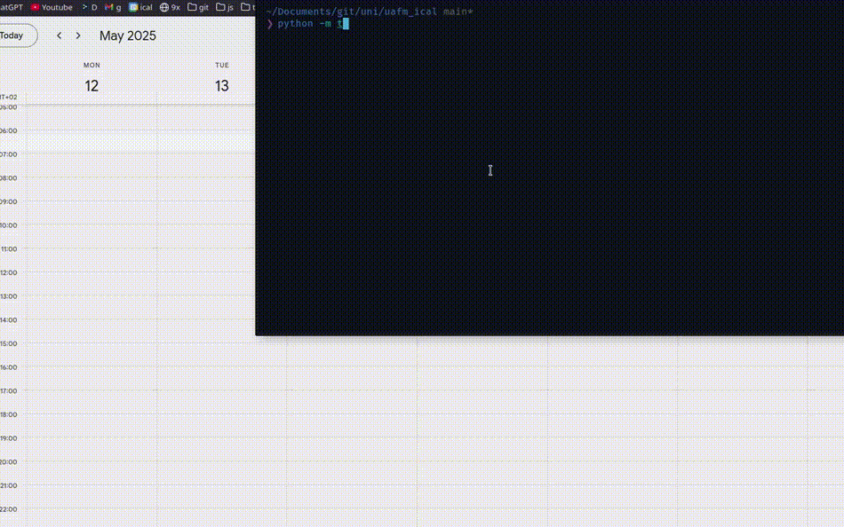
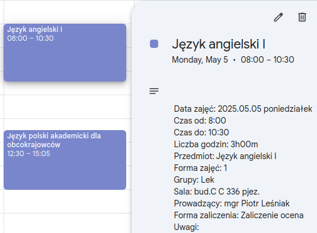
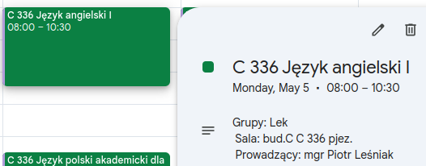

# Імпортер ICS до Google Календаря: Автоматизований імпорт розкладів 📅✨

<p align="center">
  <a href="https://github.com/Anghkooey/uafm_ical/blob/main/LICENSE">
    
  </a>
  <a href="https://www.python.org/">
    
  </a>
  <a href="https://github.com/Anghkooey/uafm_ical/commits/main">
    
  </a>
</p>

<p align="center">
  <a href="pl.md"></a>
  <a>  </a>
  <a href="README.md"></a>
  <a>  </a>
  <a href="ua.md"></a>
</p>

**Більше не потрібно вручну додавати розклад до Google Календаря! 😩 Цей Python-скрипт автоматично імпортує події з файлу **ICS (iCalendar)** без зайвих зусиль. ✨**

**Спочатку розроблений для [Університету Анджея Фрича Моджевського](https://uafm.edu.pl/). Ви можете отримати файл ICS за [цим посиланням](https://dziekanat.uafm.edu.pl/Plany/PlanyGrup).**

**✔️ Автоматичне створення календаря, якщо його немає  
✔️ Видалення старих подій (старше 30 днів)  
✔️ Очищення та форматування розкладу як професіонал**

## ✨ Основні можливості

- **Легкий імпорт:** Автоматичне додавання розкладу до Google Календаря.
- **Універсальна сумісність:** Працює з файлами ICS з різних університетських систем (наприклад, APR System, Mobilny Student).
- **Опція нового календаря:** Створює новий календар "Study", якщо не вказано інший.
- **Очищення календаря:** Видаляє події старше 30 днів перед імпортом.
- **Кольорове кодування подій:** Візуальне розрізнення типів подій (Екзамени ❤️, Лекції 🖤 тощо).
- **Обробка часових поясів:** Використовує часовий пояс вашого Google Календаря для точного часу подій.

## 🚀 Швидкий перегляд

**Подивіться, як це працює! ✨ Ця анімація показує, як скрипт імпортує ваш розклад ICS до Google Календаря.**

<div align="center">

</div>

<div align="center">
<h3>🗓️ Перегляд календаря</h3>
</div>

|                      **До**                      |                     **Після**                      |
| :----------------------------------------------: | :------------------------------------------------: |
|  |  |

<div align="center">
  <h3><strong>📝 Перегляд опису подій</strong></h3>
</div>

|                                     **До**                                     |                                    **Після**                                     |
| :----------------------------------------------------------------------------: | :------------------------------------------------------------------------------: |
|  |  |

**Кольорова легенда (типи подій):**

- ❤️ **Томат** – Екзамен
- 💜 **Виноград** – Онлайн або Скасовано
- 🖤 **Графіт** – Лекція
- 💚 **Базилік** – Заняття / Семінар
- 💙 **Павич** – Лабораторна
- 💛 **Банан** – Інше / Невідомо

**Ви можете змінити кольори, редагуючи словник `COLORS` та відповідні умови в коді.**

## **Встановлення** 🛠️

1. **Необхідні умови:** Переконайтеся, що у вас встановлено Python 3.x.
2. **Встановіть залежності:**

```bash
pip install gcsa ics pytz
```

## 🔑 Налаштування облікових даних Google API

Виконайте ці кроки, щоб авторизувати скрипт для доступу до вашого Google Календаря:

1. **Створіть проект у Google Cloud Platform (GCP):** [Інструкція](https://developers.google.com/workspace/guides/create-project)
   - **Важливо:** Увімкніть **Google Calendar API** для вашого проекту.
2. **Налаштуйте екран згоди OAuth:** [Інструкція](https://developers.google.com/workspace/guides/configure-oauth-consent)
3. **Створіть облікові дані клієнта OAuth:** [Інструкція](https://developers.google.com/workspace/guides/create-credentials#oauth-client-id) та завантажте `credentials.json`.
4. **Збережіть облікові дані:** Помістіть завантажений файл `credentials.json` у каталог `~/.credentials/`.

> **Примітка:** Цей [швидкий старт](https://developers.google.com/workspace/calendar/api/quickstart/python) може бути корисним.

## 🎉 Використання

### 🗓️ Приклад 1: Імпорт до конкретного календаря

```python
from main import ics_import
from config import calendar_id

ics_import(calendar_id)
```

(припускається, що ви маєте `calendar_id` у файлі `config.py`)

### 🌐 Приклад 2: Створити новий календар та імпортувати

```python
from main import ics_import

ics_import()
```

### 🕰️ Приклад 3: Редагувати ICS-файл (зміна часового поясу)

```python
from main import ics_edit

ics_edit()
```

Ця функція допомагає очистити і скоригувати час подій відповідно до вашого часового поясу.

## ⚙️ Як це працює

- **Робота з календарем:** Створює новий календар "Study" або використовує вже існуючий.
- **Часовий пояс:** Гарантує, що всі події відповідатимуть часовому поясу вашого календаря.
- **Очищення:** Видаляє старі події (старше 30 днів), щоб зберегти ваш календар охайним.
- **Кольори:** Призначає кольори подіям на основі їх типу.

## 🎨 Налаштування

- **Шлях до ICS:** Змініть змінну `ics_path`, щоб використовувати інший файл.
- **Автентифікація:** Встановіть `open_browser=False`, якщо ви вже авторизовані.

## 🤝 Співпраця

**Маєш ідеї? Бажаєш покращити скрипт? Форкай репозиторій, створи гілку та надсилай pull request. Зробимо цей інструмент ще кращим разом! 💪**

## 📜 Ліцензія

**Ліцензовано відповідно до [GNU General Public License v3](https://www.gnu.org/licenses/gpl-3.0.html).**

## 📚 Документація

**Офіційна документація для бібліотеки `gcsa`: [gcsa Documentation](https://google-calendar-simple-api.readthedocs.io/en/latest/index.html)**
